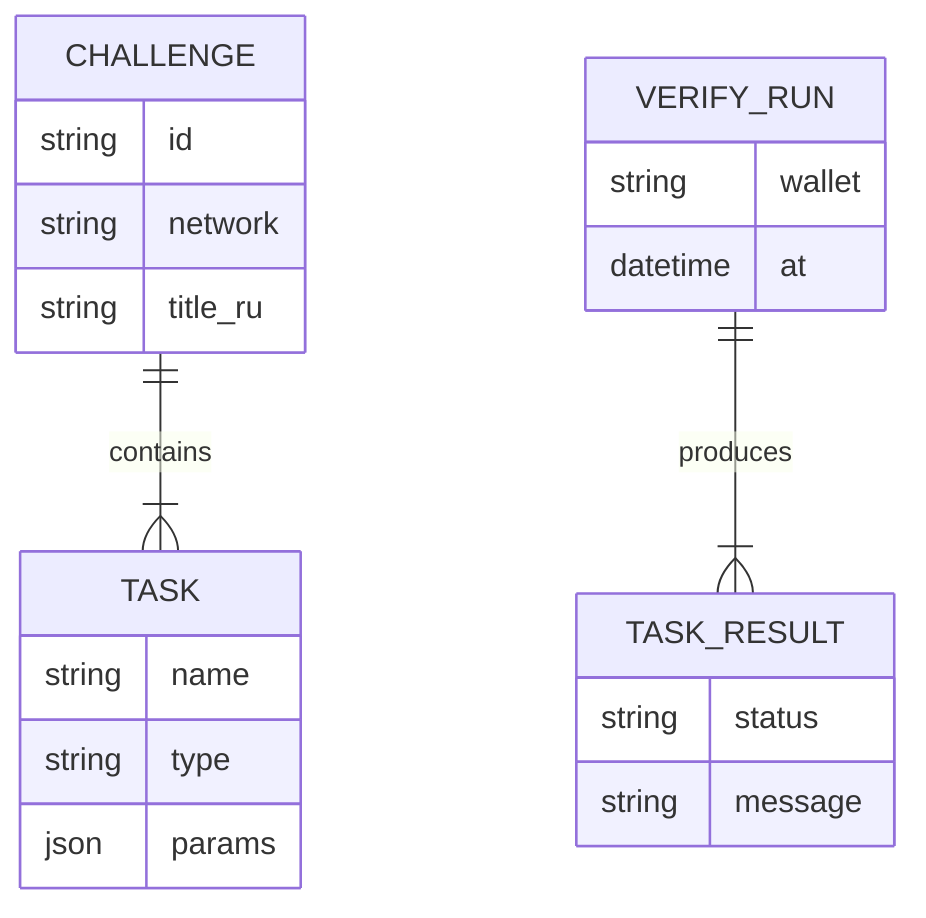

# 03. Архитектура

## Высокоуровневая схема

```
┌─────────────────────────────────────────────────────────────────┐
│                         learnverify CLI                          │
├─────────────┬─────────────┬──────────────┬──────────────────────┤
│  commands/  │  challenge/ │  verifiers/  │  rpc/                │
│  verify     │  load YAML  │  balance_min │  multi-provider      │
│  cohort     │  validate   │  transfer_*  │  consensus           │
│  doctor     │  schema     │  spl_*       │  retry / cache       │
└──────┬──────┴──────┬──────┴──────┬───────┴──────────┬───────────┘
       │             │             │                  │
       v             v             v                  v
   stdout/json   challenge.yaml   TaskResult[]    Solana Devnet RPC
```

## Принципы проектирования

1. **Read-only** — никаких подписей транзакций в MVP.
2. **Declarative challenges** — логика курса в YAML, код — универсальные verifiers.
3. **Pluggable verifiers** — новый `type` = новый класс + регистрация.
4. **Fail informative** — каждый task возвращает `pass | fail | error` + `hint` + `evidence`.
5. **RPC skepticism** — не доверять одному endpoint (grant narrative + надёжность).

---

## Структура репозитория (целевая)

```
SolanaAI/
├── package.json
├── tsconfig.json
├── src/
│   ├── cli.ts                 # entry: commander / citty
│   ├── commands/
│   │   ├── verify.ts
│   │   ├── cohort.ts
│   │   ├── doctor.ts
│   │   └── list-tasks.ts
│   ├── challenge/
│   │   ├── loader.ts
│   │   ├── schema.ts          # zod
│   │   └── types.ts
│   ├── verifiers/
│   │   ├── registry.ts
│   │   ├── base.ts
│   │   ├── balance-min.ts
│   │   ├── transfer-sent.ts
│   │   ├── transfer-received.ts
│   │   ├── spl-mint-created.ts
│   │   ├── spl-token-account.ts
│   │   └── signature-count-min.ts
│   ├── rpc/
│   │   ├── client.ts
│   │   ├── multi-provider.ts
│   │   └── consensus.ts
│   ├── report/
│   │   ├── formatter.ts       # human
│   │   └── json.ts
│   └── utils/
│       ├── pubkey.ts
│       └── csv.ts
├── challenges/
│   └── examples/              # bundled YAML
├── schema/
│   └── challenge.schema.json
├── tests/
│   ├── unit/
│   ├── integration/
│   └── fixtures/
├── docs/
├── reports/                   # pilot outputs (gitignore json)
└── .github/workflows/ci.yml
```

---

## Поток: `verify`

```
1. Parse CLI args (wallet, challenge path, --json, --rpc)
2. Load challenge YAML → Zod validate
3. Assert challenge.network === 'devnet'
4. Resolve RPC endpoints (config + env + defaults)
5. For each task in challenge.tasks (order preserved):
     a. Lookup verifier by task.type
     b. verifier.run(ctx) → TaskResult
     c. Short-circuit? NO — всегда все tasks (для полного отчёта)
6. Aggregate: VerifyReport { passed, total, tasks[], durationMs }
7. Multi-RPC consensus check на критичных reads (balance)
8. Print human | JSON; set exit code
```

### VerifyContext (per run)

```typescript
interface VerifyContext {
  wallet: PublicKey;
  challenge: Challenge;
  rpc: MultiRpcClient;
  network: 'devnet';
  options: { json: boolean; verbose: boolean };
}
```

### TaskResult

```typescript
interface TaskResult {
  name: string;
  type: string;
  status: 'pass' | 'fail' | 'error';
  message: string;           // RU-friendly
  hint?: string;             // что сделать студенту
  evidence?: Record<string, unknown>; // sig, slot, mint, ...
}
```

---

## Поток: `cohort`

```
1. Load challenge + parse CSV (columns: wallet, name?)
2. For each row (sequential, MVP — без parallel flood):
     verify(wallet) → CohortRowResult
3. Write --out JSON + print table summary
4. Exit 1 if any row < 100% AND --strict (optional)
```

**MVP:** sequential с delay 200ms между кошельками (защита RPC).

---

## Multi-RPC консенсус

### Default endpoints (Devnet)

| Приоритет | URL | Назначение |
|-----------|-----|------------|
| 1 | `https://api.devnet.solana.com` | Official |
| 2 | Helius devnet (если `HELIUS_API_KEY`) | Backup |
| 3 | User `--rpc` override | Локальный / свой |

### Правила консенсуса (MVP)

| Операция | Правило |
|----------|---------|
| `getBalance` | Запрос к 2+ RPC; если расхождение > 0 lamports → `warning` в отчёте, берём **максимум** (консервативно для `balance_min`) |
| `getSignaturesForAddress` | Primary RPC; secondary — только если primary error |
| Slot lag | Если `|slotA - slotB| > 150` → warning «RPC desync» |

### Образовательный вывод

При warning CLI добавляет блок:

```
⚠ Multi-RPC: ответы различаются. Не полагайтесь на один RPC в production.
   Подробнее: docs/student-guide.md#rpc
```

---

## Расширяемость: Registry verifiers

```typescript
// verifiers/registry.ts
const registry = new Map<string, TaskVerifier>();

export function register(type: string, verifier: TaskVerifier) {
  registry.set(type, verifier);
}

export function getVerifier(type: string): TaskVerifier {
  const v = registry.get(type);
  if (!v) throw new UnknownTaskTypeError(type);
  return v;
}
```

Добавление типа `program_deployed` в v0.2:
1. `src/verifiers/program-deployed.ts`
2. Расширить Zod schema
3. Тест + пример в challenge YAML
4. Документировать в `04-challenge-spec.md`

---

## Зависимости (MVP)

| Пакет | Назначение |
|-------|------------|
| `@solana/web3.js` | RPC, PublicKey, parsers |
| `@solana/spl-token` | Mint / ATA layout |
| `zod` | Challenge validation |
| `yaml` | Parse challenge files |
| `commander` или `citty` | CLI |
| `chalk` / `picocolors` | Terminal output |
| `vitest` | Tests |

**Без:** LangChain, LLM SDK, wallet adapters в runtime.

---

## Конфигурация

### Приоритет (высший → низший)

1. CLI flags (`--rpc`, `--network`)
2. Env: `LEARNVERIFY_RPC_PRIMARY`, `LEARNVERIFY_RPC_SECONDARY`, `HELIUS_API_KEY`
3. File: `learnverify.config.json` (cwd или `~/.learnverify/config.json`)
4. Built-in defaults

### Пример `learnverify.config.json`

```json
{
  "network": "devnet",
  "rpc": {
    "primary": "https://api.devnet.solana.com",
    "secondary": "https://devnet.helius-rpc.com/?api-key=YOUR_KEY"
  },
  "cohort": {
    "delayMs": 200
  }
}
```

---

## Диаграмма данных challenge → verify



---

## Производительность (целевые SLA MVP)

| Операция | Цель |
|----------|------|
| 1× verify, 4 tasks | < 15 s p95 |
| 30× cohort | < 3 min |
| RPC timeout | 10 s per call |
| Retries | 3 × exponential 1s, 2s, 4s |
